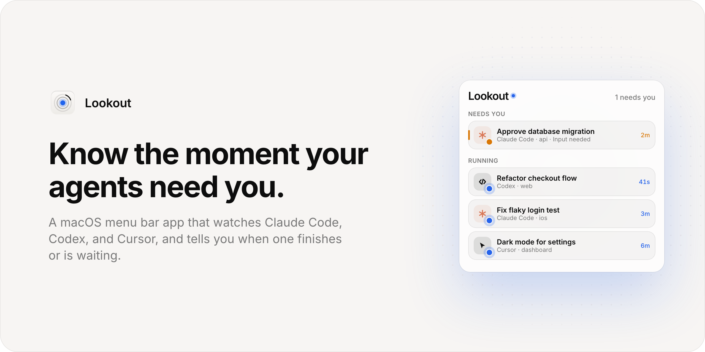

<picture>
  <source media="(prefers-color-scheme: dark)" srcset="docs/banner-dark.png">
  
</picture>

Lookout sits in your menu bar and keeps track of every coding agent you have running. When one finishes or stops to ask you something, it notifies you. Click a session to jump straight to it.

## What you get

- **A menu bar icon** that animates while agents run, turns amber when one needs you, and green when one finished and you haven't looked yet.
- **A popover** listing sessions by what needs you first: waiting, running, then done. Each row shows the title, project, and how long it has been in that state.
- **Click to jump.** Claude Code sessions bring their Terminal window forward with the right tab selected (other terminals are activated). Codex opens the thread. Cursor comes to the front.
- **Notifications** when a session starts waiting or finishes. Turns shorter than 10 seconds finish quietly. Both, the sound, and the cutoff are in Settings.

## Where the signals come from

| | State | How |
|---|---|---|
| **Claude Code** | `~/.claude/sessions/<pid>.json` | `status` is busy, idle, or waiting. Titles come from the session transcript. No hooks needed. |
| **Codex** | `~/.codex/state_N.sqlite` and each thread's rollout file | Turn start, completion, abort, and approval requests. |
| **Cursor** | `~/.lookout/events.jsonl` | Cursor keeps no usable state on disk. When you click Connect, Lookout adds a small hook to `~/.cursor/hooks.json` that appends events to this file. |

Lookout reads only local files. It has no account, server, or analytics, and makes no network requests.

Plain chat windows in the Claude and ChatGPT apps aren't tracked, since they leave nothing on disk.

## Build

Lookout builds with the Command Line Tools. No Xcode project.

```sh
./build.sh
open build/Lookout.app
```

Requires macOS 15 or later on Apple silicon. The first time you click a Terminal session, macOS asks whether Lookout may control Terminal. That permission is what lets it select the right tab.

## License

MIT
